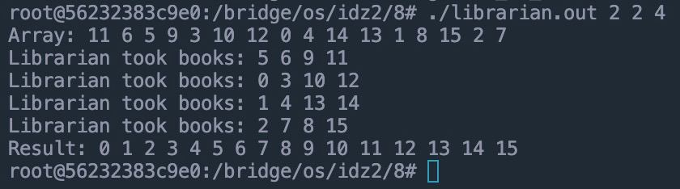
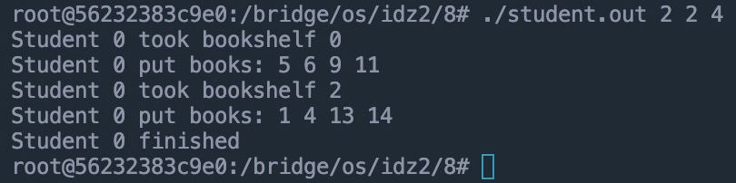
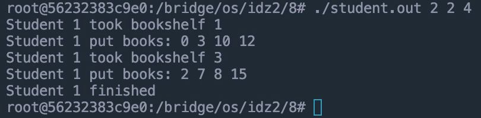

# Отчет по Идз 2 по Осям
## Вариант 22
Выполнил Гречко Андрей, группа БПИ218

### Условие
```
Задача об инвентаризации по рядам. После нового года в библиотеке университета обнаружилась пропажа каталога. После поиска и наказания виноватых, ректор дал указание восстановить каталог силами студентов. Фонд библиотека представляет собой прямоугольное помещение, в котором находится M рядов по N шкафов по K книг в каждом шкафу. Требуется создать приложение, составляющее каталог. В качестве отдельного процесса задается составление подкаталога одним студентом–процессом для одного ряда. После этого студент передает информацию процессу–библиотекарю, который сортирует ее учитывая подкаталоги, переданные другими студентами.
```

### Схема решаемой задачи
- Процесс библиотекаря запускается первым, создает все необходимые ресурсы для дальнейшей работы (память, семафоры, массив книг).
- Процесс библиотекаря создает процессы студентов.
- Процесс студента синхронно получает номер ряда, на котором он будет работать. После этого он заполняет свой подкаталог книгами, которые находятся в его ряду. Подкаталог сортируется по номерам книг. После этого процесс студента передает подкаталог процессу библиотекаря через разделяемую память.
- Процесс библиотекаря получает подкаталоги от всех студентов и сортирует их по номерам книг. После этого он выводит полученный каталог в консоль.
- Процесс библиотекаря удаляет все созданные ресурсы.

### Запуск программы

Каждому исполняемому файлу на вход передается 3 аргумента: количество рядов, количество шкафов и количество книг в шкафу. Пример запуска программы:

```bash
./librarian 2 2 4
```

```bash
./student 2 2 4
```

Также значение N*M*K должно быть меньше 1021, так как в программе используется разделяемая память из 1024 элементов, а 3 последних элемента используются как счетчики.

### Пример работы программы







### Логика работы

Вся логика работы программы не меняется в решениях на разные оценки. Различия в реализации только в том, какие средства синхронизации используются.

#### Работа на 4

В коде на 4 используются именованные семафоры Posix.

#### Работа на 5

В коде на 5 используются неименованные семафоры Posix.

#### Работа на 6

В коде на 6 используются именованные семафоры System V.

#### Работа на 7

В коде на 7 используются именованные семафоры Posix.

#### Работа на 8

В коде на 8 используются именованные семафоры System V.